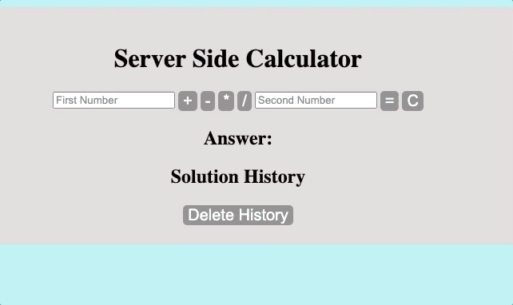

# Synchronous Calculator Challenge

## Description

Project goal was to create a web deployed calculator app that would accept basic math functions and solve for user, while displaying a "history" of the last 10 solves across a shared web facing view, and update automatically to display most recent solutions. Results must remain between sessions.

To see the fully functional site, please visit: [DEPLOYED VERSION OF APP](https://cryptic-retreat-22217.herokuapp.com/)

## Screen Shots

## Installation

There is a cloud-deployed version on heroku available at the above link, however for local viewing:

1. Create a database named `online_calc`,
2. The queries in the `database.sql` file are set up to create all the necessary tables and populate the needed data to allow the application to run correctly. The project is built on [Postgres](https://www.postgresql.org/download/), so you will want to have that installed.
3. Open up your editor of choice and run an `npm install`
4. Run `npm start` in your terminal
5. visit http://localhost:5000/ to view local version

## Built With

JQUERY, HTML, CSS, AJAX, POSTGRESQL

## Support

If you have suggestions or issues, please email me at [jakestucky@gmail.com] or on [LinkedIn](https://www.linkedin.com/in/jakestucky/)
